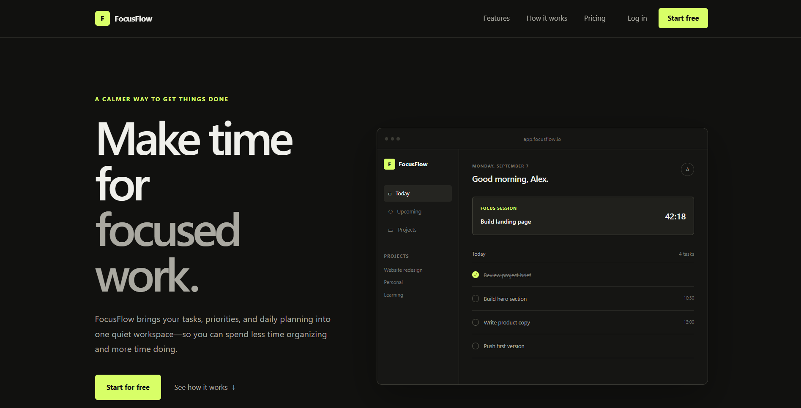

# FocusFlow

FocusFlow is a responsive productivity app landing page designed around a simple idea: helping users plan focused work without unnecessary complexity.

## Live Demo

[View FocusFlow Live](https://jayakiranyedla.github.io/focusflow-landing-page/)

## Project Preview



## Project Overview

FocusFlow is a frontend SaaS landing page built to demonstrate a clean, responsive product interface using vanilla web technologies.

The page includes a product dashboard preview, feature sections, workflow explanation, pricing cards, testimonial content, and a final call-to-action section.

The design focuses on clear typography, spacing, responsive layouts, and subtle interactions rather than heavy animations or visual effects.

## Features

- Responsive landing page for desktop, tablet, and mobile
- Product dashboard preview
- Mobile navigation menu
- Interactive focus-session timer
- Feature and workflow sections
- Pricing section with Free and Pro plans
- Responsive layout using CSS Grid and Flexbox
- Semantic HTML structure
- Custom favicon
- Clean dark-themed UI

## What I Implemented

- Built the page structure using semantic HTML5
- Created the responsive layout with CSS Grid and Flexbox
- Added mobile navigation using JavaScript
- Implemented an interactive 25-minute focus timer
- Designed reusable buttons, cards, navigation, and content sections
- Added responsive breakpoints for smaller screens
- Added basic accessibility attributes to interactive elements
- Published the project using GitHub Pages

## Built With

- HTML5
- CSS3
- JavaScript
- Git & GitHub
- GitHub Pages

## Project Structure

```text
focusflow-landing-page/
│
├── index.html
├── style.css
├── script.js
├── favicon.svg
├── focusflow-preview.png
└── README.md